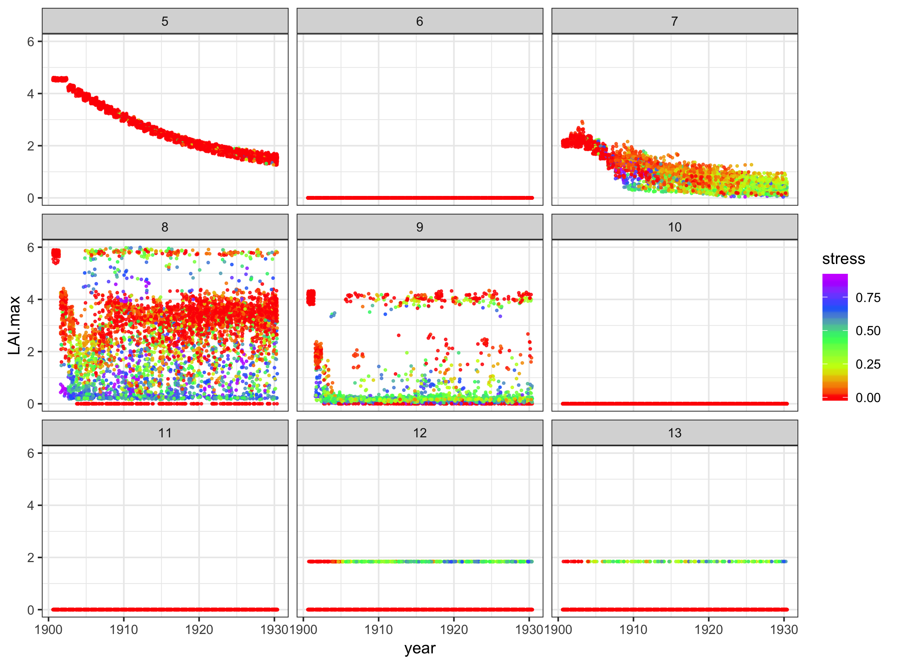
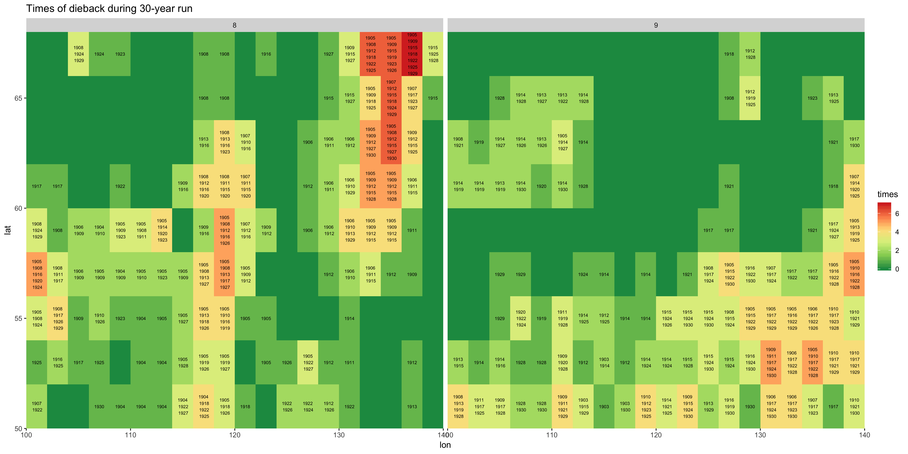
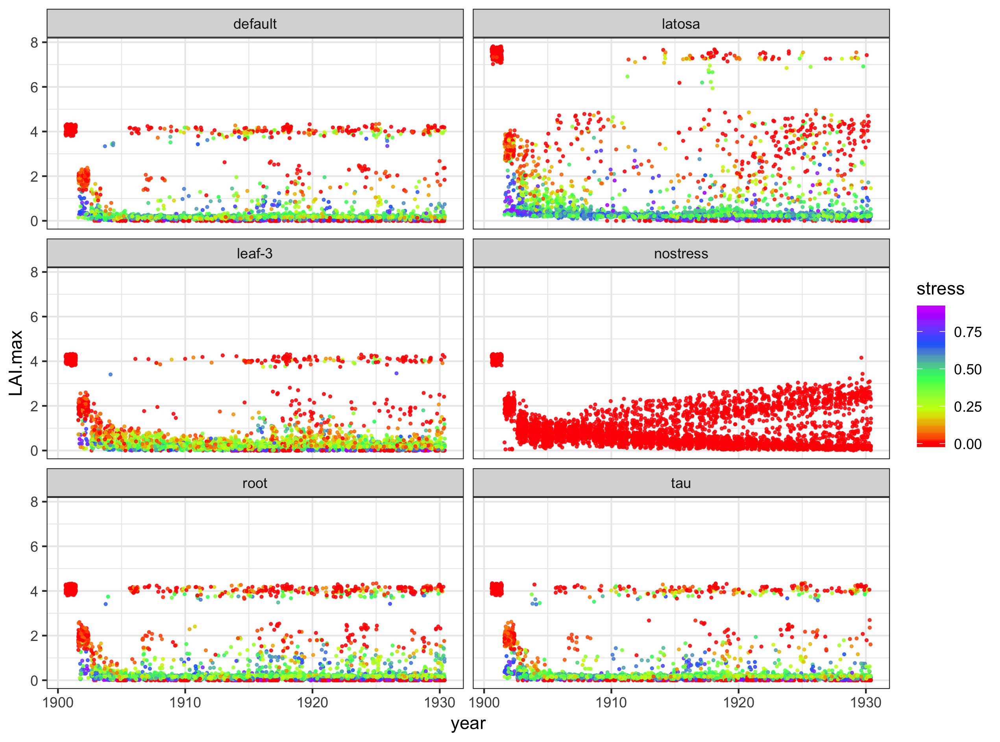
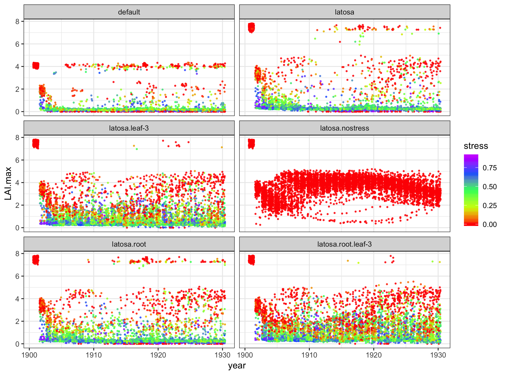
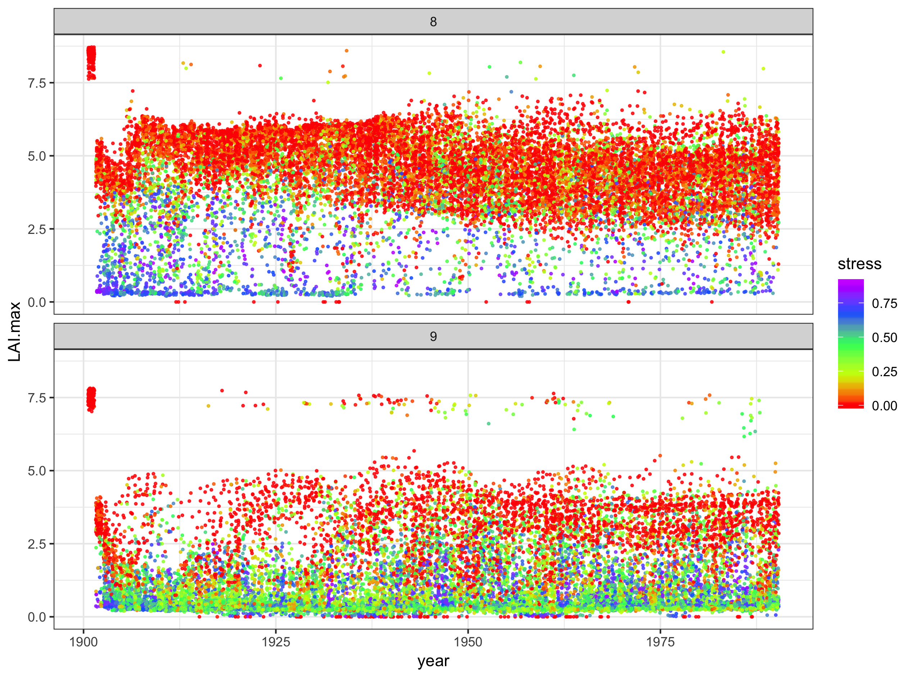
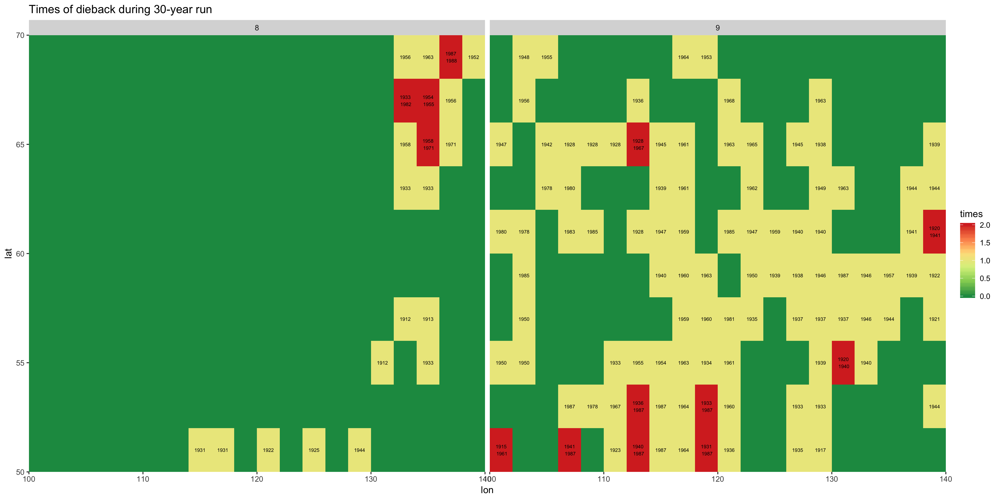

## PFT 8 and 9 fail to keep LAI

### Problem

PFT 8 and 9 cannot sustain their LAI and died continuously. 

||
|:--:|
|*Fig.1 Annual maximum LAI for 30-year simulation in Siberia. PFT 8 and PFT 9 shows regenerations for overall period.*|

||
|:---:|
|*Fig.2 Numbers and times when replanting occurred, per pixels. PFT8 (left) and PFT9 (right)*|

The low LAI caused by the lack of reserves for bud break, which is assumed to be resulted from low productivity or high (water) stress. To test this hypothesis, 4 parameters were tested with PFT 9.
1) tau_leaf. By increasing tau_leaf less carbon can be used for sustain leaf mass.
2) k_latosa. High k_latosa allows higher LAI which brings higher production.
3) psi_leaf. More negative psi_leaf generates higher gradient between soil and leaf and would reduce water stress. 
4) Dcoupling psi_root from psi_leaf. As psi_root is poorly measured, current code set psi_root same as psi_leaf but this can reduce the gradient for water pressure. Set psi_root more negative than psi_leaf would result less water stress. 

| Parameters | Default | Change |  Label|
|:-----------|:-------:|:-------:|:-:|
|tau_leaf| 180| 1000| .tau|
|k_latosa| 4500| 9000| .latosa|
|psi_leaf| -1.6| -3.0| .leaf-3|
|psi_root| =psi_leaf|=2*psi_leaf|.root

**Label: label used in fig to refer to each configration.*

||
|:--:|
|*Fig. 3 LAI result from each testcase. No water stress was checked with ENERGY_CONTROL=5 and OK_GS_FEEDBACK=n*|

From the result with no stress, we can notice two things: 1. without water stress, there is no dieback; 2. LAI is not high enough considering there is no water stress. This implies the problem was caused by the combination of high water stress and low lai.  It was already concluded that current k_latosa is too low from global run, next tests were done with double k_latosa. 

||
|:---:|
|*Fig. 4 LAI result from each parameter changes with high k_latosa.*|

Result with no water stress is closer to expected LAI than the default configuration with no water stress (Fig. 3). Both psi_leaf and psi_root did increase LAI, and the configuration with all add-up showed the best result. Thus, all add-up configuration was tested for longer years, 90 years.

||
|:--:|
|*Fig. 5 Anuual maximum LAI from 90-year Siberia run with double k_latosa, psi_leaf -3, and psi_root -6. PFT8 (up) and PFT9 (down)*|

||
|:--:|
|*Fig. 6 Numbers and times when replanting occurred per pixels from all add-up configuration. PFT8 (left) and PFT9 (right)*|

About reserves 

